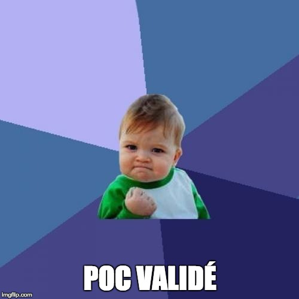

# Présentation du concept de la blockchain

<!-- .slide: class="page-title" -->

## Le bitcoin, la première monnaie virtuelle ...

<figure style="width: 100%">
    
</figure>
 
 

<!-- .element class="fragment" data-fragment-index="1" -->
- Créée en 2009 par Satoshi Nakamoto

 
<!-- .element class="fragment" data-fragment-index="2" -->
- Virtuelle
 
 

<!-- .element class="fragment" data-fragment-index="3" -->
- Mais avec une vraie valeur marchande car accepté chez de nombreux commerçants et tradée

## à la réputation sulfureuse...

<figure  style="display: block; float: left; margin: 30px 0; width: 50%">
    
</figure>

<figure class="fragment" data-fragment-index="1"  style="display: block; float: left; margin: 30px 0; width: 50%">
    
</figure>

<figure class="fragment" data-fragment-index="2"  style="display: block; float: left; margin: 30px 0; width: 50%">
    
</figure>

<figure class="fragment" data-fragment-index="3"  style="display: block; float: left; margin: 30px 0; width: 50%">
    
</figure>

## ... mais qui a des nombreuses qualités

<figure style="display: block; margin: auto; width: 15%">
    
</figure>

<figure style="display: block; margin: auto; width: 15%">
    
</figure>

<figure class="fragment" data-fragment-index="1"  style="display: block; margin: auto; width: 30%">
    
</figure>

## La blockchain

La blockchain est la technologie sous-jacente à la crypto-monnaie Bitcoin.
<figure class="fragment" data-fragment-index="1"  style="display: block; margin: auto; width: 30%">
    
</figure>

<!-- .element class="fragment" data-fragment-index="2" -->
C'est une base de donnée distribuées.

<!-- .element class="fragment" data-fragment-index="3" -->
Ce système vise à répondre aux problèmatiques suivantes du bitcoin :

<!-- .element class="fragment" data-fragment-index="3" -->
- Désintermédiation : Échange des informations directement entre utilisateurs 

<!-- .element class="fragment" data-fragment-index="4" -->
** => Echange peer-to-peer**

<!-- .element class="fragment" data-fragment-index="3" -->
- Traçabilité : Empêcher que l'on donne deux fois le même bitcoin

<!-- .element class="fragment" data-fragment-index="5" -->
** => Garde les traces de transaction dans un registre**

<!-- .element class="fragment" data-fragment-index="3" -->
- Consensus distribué : Garantir la monnaie sans autorité centralisée

<!-- .element class="fragment" data-fragment-index="6" -->
** => les utilisateurs conservent ce registre et vérifient les transactions**

## Qu'est-ce que la blockchain ?

- un grand livre de compte...
- distribué...
- sans organe central de contröle...
- infalsifiable...
- et qui contient un historique fiable des transactions effectuées depuis le lancement du système.

