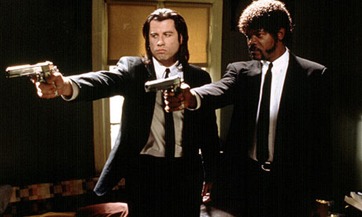
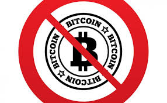

# Présentation du concept de la blockchain

<!-- .slide: class="page-title" -->

## Bitcoin et blockchain

La blockchain est la technologie sous-jacente à la crypto-monnaie Bitcoin.

Le Bitcoin a mauvaise réputation :

<figure class="fragment" data-fragment-index="1" style="display: block; float: left; margin: 30px 0; width: 50%">
    
</figure>

<figure class="fragment" data-fragment-index="2"  style="display: block; float: left; margin: 30px 0; width: 50%">
    
</figure>

<figure class="fragment" data-fragment-index="3"  style="display: block; float: left; margin: 30px 0; width: 50%">
    
</figure>

<figure class="fragment" data-fragment-index="4"  style="display: block; float: left; margin: 30px 0; width: 50%">
    
</figure>

## Les problèmatiques adressées par la blockchain

<figure class="fragment" data-fragment-index="1"  style="display: block; margin: auto; width: 30%">
    
</figure>

<!-- .element class="fragment" data-fragment-index="2" -->
Ce système vise à répondre aux problèmatiques suivantes du bitcoin :

<!-- .element class="fragment" data-fragment-index="2" -->
- Désintermédiation : Échange des informations directement entre utilisateurs 

<!-- .element class="fragment" data-fragment-index="3" -->
** => Echange peer-to-peer**

<!-- .element class="fragment" data-fragment-index="2" -->
- Traçabilité : Empêcher que l'on donne deux fois le même bitcoin

<!-- .element class="fragment" data-fragment-index="4" -->
** => Garde les traces de transaction dans un registre**

<!-- .element class="fragment" data-fragment-index="2" -->
- Consensus distribué : Garantir la monnaie sans autorité centralisée

<!-- .element class="fragment" data-fragment-index="5" -->
** => les utilisateurs conservent ce registre et vérifient les transactions**

## Qu'est-ce que la blockchain ?

- un grand livre de compte...
- distribué...
- sans organe central de contröle...
- infalsifiable...
- et qui contient un historique fiable des transactions effectuées depuis le lancement du système.

## En quoi est-ce révolutionnaire ?

 

  "La chaîne de blocs permet aux gens qui ne se font pas confiance de collaborer 
  sans avoir à passer par une autorité centrale neutre. Autrement dit, c’est une machine à créer de la confiance."

 
 
 

  "La chaîne de blocs est un registre public de confiance, que tout le monde peut partager et inspecter, mais qu’aucun utilisateur unique ne contrôle."

 
 

  "L’expansion des chaînes de blocs est redoutable pour “le marché de la confiance”, qui comprend les institutions et bureaucraties centralisées comme les banques, les chambres de compensation et les autorités gouvernementales"

