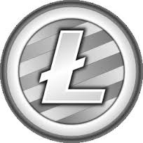

# Les champs d'application de la bloc chain

<!-- .slide: class="page-title" -->

## Les crytos monnaies

<figure  style="display: block; margin: auto; width: 30%">
    
</figure>

<figure style="display: block; float: left; margin: 30px 0; width: 20%">
    
</figure>
<figure style="display: block; float: left; margin: 30px 0; width: 15%">
    
</figure>
<figure style="display: block; float: left; margin: 30px 0; width: 15%">
    
</figure>
<figure style="display: block; float: left; margin: 30px 0; width: 15%">
    
</figure>
<figure style="display: block; float: left; margin: 30px 0; width: 15%">
    
</figure>
<figure style="display: block; float: left; margin: 30px 0; width: 15%">
    
</figure>

Namecoin : dns decentralisé
2ème génération : Etherium, Monero et Nxt

## Les banques

<figure  style="display: block; margin: auto; width: 50%">
    
</figure>

 OU 

<figure class="fragment" data-fragment-index="1" style="display: block; margin: auto; width: 50%">
    
</figure>

Pas de frais d'administration et d'infrastructure

**Consentium R3**
Les banques arriveront t-elles à canaliser cette technologie qui, par nature, les rends obsolêtes ?

## Et plus encore

<figure class="fragment" data-fragment-index="1"  style="display: block; margin: auto; width: 30%">
    
</figure>
Notaires :actes de proprièté, cadastre
Etat : Système de vote, monnaie cryto pour monnaie nationale...

    La Blockchain donnerait le pouvoir et le contrôle au peuple au lieu de le concentrer dans les mains des grands acteurs, états ou multinationales. 

