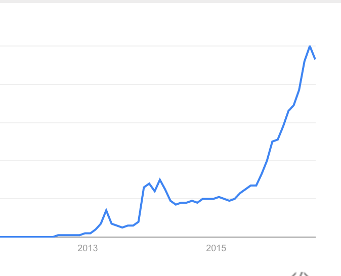
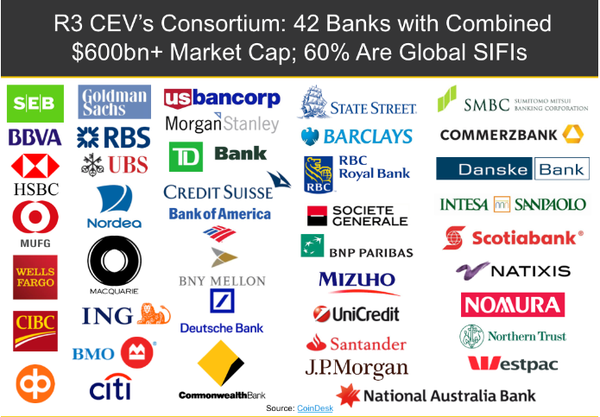
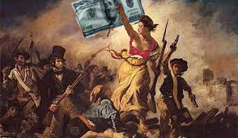

# En quoi est-ce révolutionnaire ?

<!-- .slide: class="page-title" -->

## Un effet de mode ?

Recherche du mot clé blockchain sur le web :

<figure  style="width: 100%">
    
</figure>

Source : www.google-trend.com

## Tiers de confiance décentralisé

*Actuellement :* 
<figure  style="width: 100%">
    
</figure>

[Source : http://fr.artquid.com ](http://fr.artquid.com/page/505/j-ai-achete-une-oeuvre-comment-regler-son-achat-par-tiers-de-confiance.html)

Le tiers de confiance peut être une banque, un état, un notaire, un partenaire de paiement...

 
 

Avec la blockchain, ce tiers de paiement disparaît.

## Une machine à générer de la confiance
 

  "La chaîne de blocs permet aux gens qui ne se font pas confiance de collaborer 
  sans avoir à passer par une autorité centrale neutre. Autrement dit, c’est une machine à créer de la confiance."

 
 
 

  "La chaîne de blocs est un registre public de confiance, que tout le monde peut partager et inspecter, mais qu’aucun utilisateur unique ne contrôle."

 
 

  "L’expansion des chaînes de blocs est redoutable pour “le marché de la confiance”, qui comprend les institutions et bureaucraties centralisées comme les banques, les chambres de compensation et les autorités gouvernementales"

## Les avantages d'un tiers de confiance autonome et décentralisé

    <figure  style="height: 200px;">
        
    </figure>
    
plus rapide (10 minutes de confirmation)

    
incorruptible (décentralisé et publique)

    <figure  style="height:200px;">
        
    </figure>

    <figure  style="height:200px;">
        
    </figure>
    
bien moins cher (frais de structure, personnel...)

Source https://christellemarot.com/2016/04/01/la-norme-mondiale-anti-corruption-sous-influence-britannique/

Source http://cartouchesdencrepascher.fr/2015/08/12/comment-faire-des-economies-sur-vos-impressions/

## Le domaine bancaire en effervescence

<figure  class="fragment" data-fragment-index="1"  style="display: block; margin: auto; width: 50%">
    
</figure>

 OU 

<figure class="fragment" data-fragment-index="2" style="display: block; margin: auto; width: 50%">
    
</figure>

Les banques arriveront t-elles à canaliser cette technologie qui, par nature, les rends obsolêtes ?

## Le consortium R3 CEV

<figure>
    
</figure>

## Mais d'autres acteurs sont concernés

**Les assurances** : Axa, Allianz et Lloyds investissent, des mutuelles décentralisées apparaîssent

 
<!-- .element class="fragment" data-fragment-index="1" -->
**Notaires** :actes de proprièté, cadastre (ghana, honduras)...

 
 

<!-- .element class="fragment" data-fragment-index="2" -->
**Etat** : Système de vote, diplômes...

 
 

<!-- .element class="fragment" data-fragment-index="3" -->
**Uberisation de l'uberisation** : remplacement d'uber, de airbnb, de kickstarter...

 
 

 <!-- .element class="fragment" data-fragment-index="4" -->
**Et une infinité d'autres applications qu'il reste à inventer.**

##Une révolution potentielle...
 
 
<figure class="fragment" data-fragment-index="1"  style="display: block; margin: auto; width: 100%">
    
</figure>

 

    La Blockchain a le potentiel de rendre le pouvoir et le contrôle au peuple au lieu de le concentrer dans les mains des grands acteurs, états ou multinationales. 

##... mais probablement canalisée
 
 
<figure style="display: block; margin: auto; width: 100%">
    
</figure>

 

    Mais beaucoup des grands acteurs suscités sont déjà dans la course pour inciter à un peu plus de pudeur et de modération.

