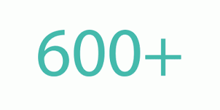

# Les principaux projets autour de la blockchain

<!-- .slide: class="page-title" -->

## Les cryptos monnaies

<figure  style="display: block; margin: auto; width: 30%">
    
</figure>

<figure style="display: block; float: left; margin: 30px 0; width: 20%">
    
</figure>
<figure style="display: block; float: left; margin: 30px 0; width: 15%">
    
</figure>
<figure style="display: block; float: left; margin: 30px 0; width: 15%">
    
</figure>
<figure style="display: block; float: left; margin: 30px 0; width: 15%">
    
</figure>
<figure style="display: block; float: left; margin: 30px 0; width: 15%">
    
</figure>
<figure style="display: block; float: left; margin: 30px 0; width: 15%">
    
</figure>

## Ethereum : blockchain 2.0
 
 

En 2014, un constat : 
 

<!-- .element class="fragment" data-fragment-index="2" -->
**de + et + d'utilisations détournées du réseau bitcoin (alter coins, dns, stockage de fichier).**

 
 

Le concept :  
 

<!-- .element class="fragment" data-fragment-index="4" -->
**une blockchain 2.0**, améliorée de manière à pouvoir stocker du code dans la blockchain 
et qui ouvre une infinité de possibilité aux développeurs.

 
 

<figure style="width: 40%">
    
</figure>

Récolte 18 millions de dollars sur Kickstarter pour son développement

## Les smart contracts 

Des programmes autonomes qui exécutent automatiquement les conditions et termes d’un contrat, 
sans permettre d’intervention humaine une fois créés (code as law)

 

Un smart contract peut envoyer et recevoir de l'argent et communiquer avec d'autres smart contracts

<figure style="width: 70%;margin:auto;" class="fragment" data-fragment-index="3">
    
</figure>

http://fr.slideshare.net/philippecamacho/smart-contracts

## Exemple : des paris hippiques
 

<!-- .element class="fragment" data-fragment-index="1" -->
Les développeurs créés un smart-contract contenant le code nécessaire (une adresse dans la blockchain).

 

<!-- .element class="fragment" data-fragment-index="2" -->
Avant la course, les parieurs envoie des transactions vers l'adresse du smart contract avec leur mise,
leur pronostic et l'id de la course.
 
 

<!-- .element class="fragment" data-fragment-index="3" -->
Le smart contract calcule automatiquement les côtes en fonction des paris.
 
 

<!-- .element class="fragment" data-fragment-index="4" -->
Le smart-contract envoie automatiquement l'argent aux gagnants  
dès la publications des résultats de la course sur un site hippique fiable.
 
 

<!-- .element class="fragment" data-fragment-index="5" -->
Et goodbye les bookmakers...

##Slock.it : nouveau mode de location, vente et partage 

Basé sur Ethereum

Au croisement entre blockchain et I.O.T, Slock.it propose de gérer des verrous d'objets connectés par la blockchain.

Cela permet de vendre, louer ou partager ses objets, sans aucun intermédiaires.

<figure>
    
</figure>

## Augur : blockchain et voyance

Basé sur Ethereum

<figure>
    
</figure>

 
 

Un outil de prédiction d’événements futurs (financiers, sportifs, elections), 
se basant sur l’input d’utilisateurs faisant des paris sur la réalisation ou non de certaines prédictions.

## Perspective vis à vis des assurances 

<!-- .element class="fragment" data-fragment-index="1" -->
A terme les smarts-contracts pourraient permettre aux assurés comme aux assureurs de s’émanciper des phases déclaratives : 
formulaires, réclamation, vérification, déclenchement de l’indemnisation…
 
 

<!-- .element class="fragment" data-fragment-index="2" -->
Ex sur assurance indicielle : 
Un assureur passe un contrat avec un agriculture est s'engage à lui verser une indemnité 
en cas de 30 jours de sécheresse consécutifs.
  

<!-- .element class="fragment" data-fragment-index="3" -->
Un smart contract est ainsi créé et va aller chercher journalièrement les infos sur le temps sur un site fiable.
  

<!-- .element class="fragment" data-fragment-index="4" -->
Si la condition stipulée dans le contrat se produit, alors l'indemnité est automatiquement versée, sans intervention de l'assuré ni de l'assureur.
  

<!-- .element class="fragment" data-fragment-index="5" -->
Blockchain + assurances P2P (Friendsurance ou inspeer.me): des systèmes d’assurance quasi-autonomes et 
auto-régulés (Wekeep : Projet français de mutuelle décentralisée)

## IBM Hyperledger project
IBM travaille actuellement pour le projet Hyperledger, pour le compte de gens
qui ont le plus à perdre s'ils ne sont pas au coeur de la révolution 

Le code est disponible en open-source sur Github
https://github.com/openblockchain

**BAAS** : IBM propose la plateforme Bluemix avec des solutions maison de Smart Contract

## Et bien d'autres encore...

**Applications finance** : Médici (stock market basé sur counterparty), coinsetter

**Crowdfunding** : Lighthouse

**Social messaging** : Gem

**Brevet** : Proof of Existence 

**DNS** : Namecoin

**Filestorage, hosting** : Datacoin, SpurJ, Burstcoin

**Identification des individus** : Cetas, KYC-Chain

**Traçabilité des marchandise** : Provenance

**Cloud décentralisé** : Enigma

**Organisation décentralisées** : Colony

## Sans oublier des succès étourdissants comme "The DAO"

<!-- .element class="fragment" data-fragment-index="1" -->
**Decentralised Autonomous Organisation** : ordinateur décentralisé qui traite des täches de manière autonome, 
de manière fiable et conforme aux règles fixées par l'entreprise

<!-- .element class="fragment" data-fragment-index="2" -->
**The DAO** : Fond de financement pour les projets autour des DAOs

Campagne Kickstarter qui a réuni plus de 11 millions d'ethers (143 millions d'euros à l'époque)

<figure class="fragment" data-fragment-index="4"  style="display: block; margin: auto; width: 100%">
    
</figure>

## Et des échecs retentissants comme...the DAO

<figure class="fragment" data-fragment-index="1"  style="display: block; margin: auto;">
    
</figure>

<figure class="fragment" data-fragment-index="2"  style="display: block; margin: auto;">
    
</figure>

## L'iceberg
 

<!-- .element class="fragment" data-fragment-index="1" -->
Le smart contract du DAO avait une faille qui avait été relevé par un expert en sécurité dans un article.
  

<!-- .element class="fragment" data-fragment-index="2" -->
Cette faille a permis à un groupe d'attaquants de siphonner 3,6 millions d'ether
  

<!-- .element class="fragment" data-fragment-index="3" -->
Heureusement, les fonds volés sont bloqués par le protocole pendant 27 jours.
  

<!-- .element class="fragment" data-fragment-index="4" -->
Une équipe d'attaquant white hat à mené la même attaque sur le DAO pour sécuriser les 7,2 millions d'ether restants.
  

<!-- .element class="fragment" data-fragment-index="5" -->
Reste à trouver une solution pour récupérer l'argent auprès des pirates

## Peux-on encore sauver Leonardo ?

- Soft fork : patch des mineurs pour empêcher l'attaquant de retirer les fonds volés
 - juste un moyen de gagner du temps,
 - les mineurs doivent changer leurs software,
 - flag optionnel que chaque mineur choisit d'activer,
 - ne marchera que si adopté par la majorité des mineurs
 
=> Pas acceptée car entrainait une vulnérabilité aux attaques DOS

- Hard fork
 - upgrade de tous les clients et des mineurs (Mist, Geth),
 - ne marchera que si adopté par la majorité des mineurs,
 - remplace le contract défectueux par un contrat corrigé,
 - pas de rollback ni de perte de transaction,
 - récupéreration et redistribution de tous les ethers volés

## Ethereum remis en cause ?
 

<!-- .element class="fragment" data-fragment-index="1" -->
Le hard fork devrait se faire le 21 Juillet prochain.
    

<!-- .element class="fragment" data-fragment-index="2" -->
Le DAO et ses investisseurs seront sauvés, *mais à quel prix* ?
  

<!-- .element class="fragment" data-fragment-index="3" -->
- renie le principe de l'immutabilité du code de la blockchain 

<!-- .element class="fragment" data-fragment-index="4" -->
- force tous les mineurs Ethereum à intervenir à cause d'un seul smart contract (The DAO) défaillant
    

<!-- .element class="fragment" data-fragment-index="5" -->
**Le principe du code immutable, pilier d'Ethereum, est remis en question.**
